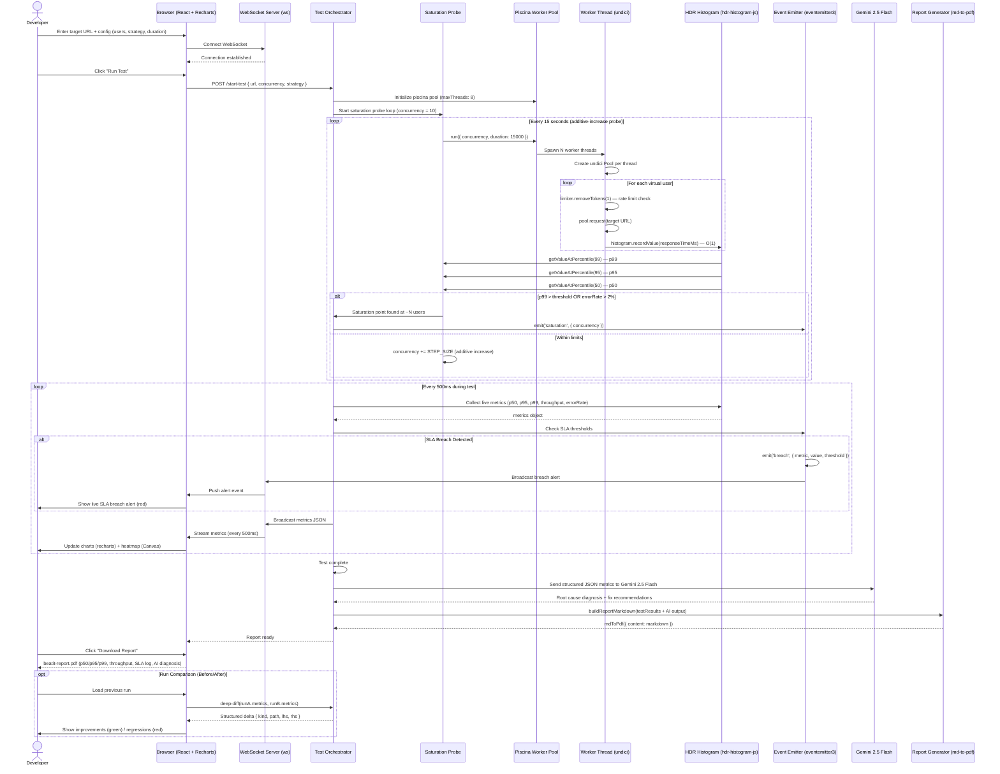

# BeatIT — Sequence Diagram

```mermaid
sequenceDiagram
    actor Dev as Developer
    participant UI as Browser (React + Recharts)
    participant WS as WebSocket Server (ws)
    participant Orch as Test Orchestrator
    participant Probe as Saturation Probe
    participant Pool as Piscina Worker Pool
    participant Worker as Worker Thread (undici)
    participant Hist as HDR Histogram (hdr-histogram-js)
    participant EE as Event Emitter (eventemitter3)
    participant AI as Gemini 2.5 Flash
    participant PDF as Report Generator (md-to-pdf)

    Dev->>UI: Enter target URL + config (users, strategy, duration)
    UI->>WS: Connect WebSocket
    WS-->>UI: Connection established

    Dev->>UI: Click "Run Test"
    UI->>Orch: POST /start-test { url, concurrency, strategy }

    Orch->>Pool: Initialize piscina pool (maxThreads: 8)
    Orch->>Probe: Start saturation probe loop (concurrency = 10)

    loop Every 15 seconds (additive-increase probe)
        Probe->>Pool: run({ concurrency, duration: 15000 })
        Pool->>Worker: Spawn N worker threads
        Worker->>Worker: Create undici Pool per thread

        loop For each virtual user
            Worker->>Worker: limiter.removeTokens(1) — rate limit check
            Worker->>Worker: pool.request(target URL)
            Worker->>Hist: histogram.recordValue(responseTimeMs) — O(1)
        end

        Hist->>Probe: getValueAtPercentile(99) — p99
        Hist->>Probe: getValueAtPercentile(95) — p95
        Hist->>Probe: getValueAtPercentile(50) — p50

        alt p99 > threshold OR errorRate > 2%
            Probe->>Orch: Saturation point found at ~N users
            Orch->>EE: emit('saturation', { concurrency })
        else Within limits
            Probe->>Probe: concurrency += STEP_SIZE (additive increase)
        end
    end

    loop Every 500ms during test
        Orch->>Hist: Collect live metrics (p50, p95, p99, throughput, errorRate)
        Hist-->>Orch: metrics object

        Orch->>EE: Check SLA thresholds
        alt SLA Breach Detected
            EE->>EE: emit('breach', { metric, value, threshold })
            EE->>WS: Broadcast breach alert
            WS->>UI: Push alert event
            UI->>Dev: Show live SLA breach alert (red)
        end

        Orch->>WS: Broadcast metrics JSON
        WS->>UI: Stream metrics (every 500ms)
        UI->>Dev: Update charts (recharts) + heatmap (Canvas)
    end

    Orch->>Orch: Test complete

    Orch->>AI: Send structured JSON metrics to Gemini 2.5 Flash
    AI-->>Orch: Root cause diagnosis + fix recommendations

    Orch->>PDF: buildReportMarkdown(testResults + AI output)
    PDF-->>Orch: mdToPdf({ content: markdown })
    Orch-->>UI: Report ready

    Dev->>UI: Click "Download Report"
    UI-->>Dev: beatit-report.pdf (p50/p95/p99, throughput, SLA log, AI diagnosis)

    opt Run Comparison (Before/After)
        Dev->>UI: Load previous run
        UI->>Orch: deep-diff(runA.metrics, runB.metrics)
        Orch-->>UI: Structured delta { kind, path, lhs, rhs }
        UI->>Dev: Show improvements (green) / regressions (red)
    end
```